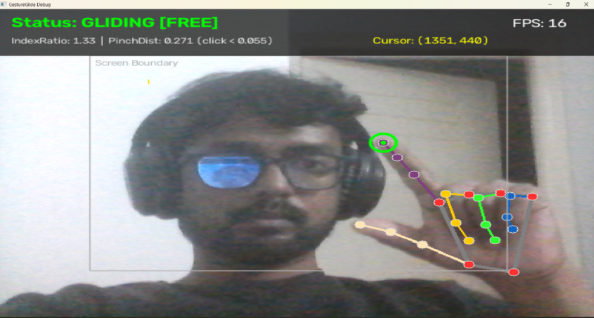

# GestureGlide 🖐️✨

> **Glide your mouse cursor through the air using real-time hand tracking and computer vision.**

GestureGlide is a lightweight Python application that transforms your standard laptop webcam into a spatial mouse controller. Point and move your index finger in front of the camera to smoothly glide your OS cursor, and pinch your thumb and index finger together to click.

---

## 📸 Demonstration

<p align="center">
  
</p>

*Real-time spatial tracking HUD showing 21-point joint skeleton, fingertip crosshair, active boundary box, and live telemetry (FPS, index ratio, pinch distance, cursor coordinates).*

---

## ✨ Features

- **Zero Extra Hardware**: Works with any standard integrated or USB webcam (no leap motion or depth sensors required).
- **Sub-millisecond Cursor Control**: Uses native Windows `SetCursorPos` with automatic fallback to PyAutoGUI for near-zero latency.
- **Adaptive EMA Smoothing**: Exponential Moving Average (EMA) filtering combined with dead-zone thresholding prevents hand tremor and micro-jitter while keeping cursor motion responsive.
- **Active Area Mapping**: Automatically scales the inner 70% of the camera frame to span 100% of your screen, meaning you never have to strain or move your hand off-camera to reach screen corners.
- **Pinch-to-Click**: Natural pinch gesture (thumb tip meeting index tip) triggers reliable OS left-clicks with built-in debouncing.
- **Floating On-Screen HUD**: Real-time OpenCV debug window floating on top of your workspace showing your hand landmark skeleton, fingertip crosshairs, active screen boundaries, and live telemetry (FPS, pinch distance, extension ratios).
- **Mode Toggle (Hotkeys)**: Switch between **Free Tracking Mode** (cursor follows finger effortlessly) and **Strict Mode** (cursor only tracks when index finger is explicitly isolated) with a single keystroke (`t`).

---

## 🚀 Quickstart

### 1. Clone the repository
```bash
git clone https://github.com/mohammadasif090/GestureGlide.git
cd GestureGlide
```

### 2. Install dependencies
```bash
pip install -r requirements.txt
```

> **Note**: On the first run, GestureGlide will automatically download the official MediaPipe `hand_landmarker.task` model bundle (~7.5 MB) if not already present.

### 3. Run GestureGlide
```bash
python main.py
```

---

## 🎮 Controls & Gestures

| Gesture / Action | Result |
| :--- | :--- |
| **Move Index Finger** | Glides mouse cursor across your desktop |
| **Pinch (Thumb + Index)** | Performs a left mouse click |
| **Press `t`** | Toggles between **Free Tracking** and **Strict Pointing** mode |
| **Press `ESC` or `q`** | Closes camera feed and exits the program |

---

## 🛠️ Project Structure

```
GestureGlide/
├── assets/
│   └── demo.png         # Live demonstration screenshot
├── main.py              # Main application loop, HUD rendering, and keyboard handling
├── hand_tracker.py      # MediaPipe Tasks HandLandmarker wrapper & auto-downloader
├── gesture.py           # Gesture recognition, finger extension ratios & pinch detection
├── mouse_control.py     # OS mouse movement, EMA smoothing & Win32/PyAutoGUI bindings
├── config.py            # Centralized settings (thresholds, smoothing, camera config)
├── requirements.txt     # Python package dependencies
├── .gitignore           # Git ignore rules
└── README.md            # Documentation
```

---

## ⚙️ Configuration

Tune parameters in `config.py` to match your environment and preference:

```python
# --- Camera & Tracking ---
CAMERA_INDEX = 0             # 0 for default internal webcam
CAMERA_PADDING_X = 0.15      # Fraction of horizontal border padding (active screen area)
CAMERA_PADDING_Y = 0.15      # Fraction of vertical border padding

# --- Mouse Dynamics ---
SMOOTHING_ALPHA = 0.35       # 0.0 (heavy smoothing) to 1.0 (instant/raw motion)
DEAD_ZONE_RADIUS = 3         # Pixels of jitter to ignore
PINCH_THRESHOLD = 0.055      # Normalized distance between thumb and index to trigger click
CLICK_COOLDOWN = 0.4         # Seconds between consecutive clicks (debounce)

# --- Behavior ---
ALWAYS_TRACK_HAND = True     # True for Free Tracking (Touchpad style), False for Strict Pointing
DEBUG_WINDOW_TOPMOST = True  # Keep OpenCV preview floating on top
```

---

## 📜 License

MIT License. Free to use, modify, and distribute.
